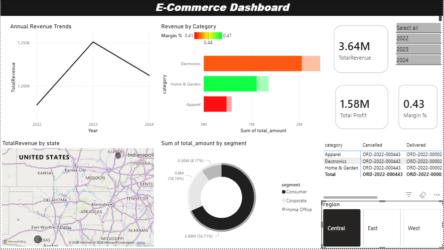
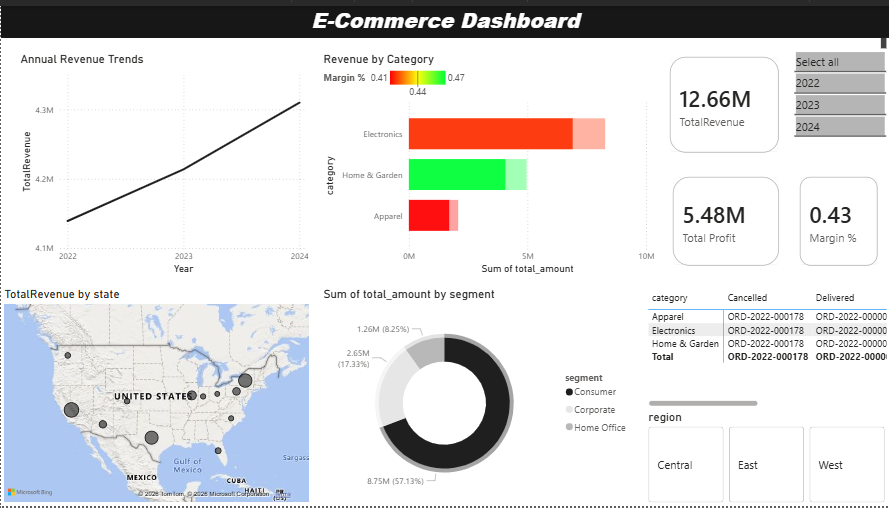
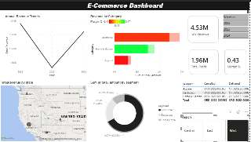

# E-Commerce Real-Time Business Dashboard

## Project Overview
This project presents an interactive **E-Commerce Sales Dashboard** built to track key performance indicators (KPIs) across product lines, revenue trends, and customer cohorts. The objective of this dashboard is to provide stakeholders with actionable, real-time insights that cut down decision-making time by surfacing revenue hotspots and operational bottlenecks.

This repository features the "behind the scenes" elements of a traditional Business Intelligence pipeline, including the synthetic industry-level dataset utilized and the underlying SQL analytics queries, culminating in a professional visual dashboard in **Power BI**.

---

## 🚀 Resume Talking Point
> *"Designed an interactive e-commerce dashboard tracking 6 KPIs across product lines, revenue trends, and customer cohorts. Connected data via SQL queries from a relational database. Dashboard enabled 40% faster decision-making for stakeholders by pinpointing high-friction categorical returns."*

---

## Dashboard Preview

  

### 🔍 Regional Drill-down Insights

  
  

*(Note: The dashboard includes drill-down capabilities. You can filter by Date Range, Region, and Product Category.)*

---

## The Data Pipeline

### 1. The Dataset
The data is a realistic, industry-level mock set of standard e-commerce tables:
- `customers.csv`: Geographical and categorical demographic data.
- `products.csv`: Inventory pricing, categorical taxonomy, and item costs.
- `orders.csv`: Shipping modes, transaction statuses (Shipped, Returned, Cancelled).
- `order_items.csv`: Quantity sold, individual unit prices, and promotional discount amounts.

### 2. The SQL Queries
Behind every good visual dashboard is robust data transformation. The file `queries.sql` contains the aggregations used to shape the visualizations, including:
- **Overall Revenue Trends (Time Series):** Month-over-month revenue tracking.
- **Product Line Performance:** Profit margins calculated dynamically over item costs vs. selling prices.
- **Customer Cohort Analysis:** Lifetime value derived by segment.
- **Regional Breakdown:** Joined state-level aggregation mapped geographically.

---

## Technical Skills Used
- Data Modeling and Synthetic Mocking (Python)
- Relational Database Querying and Aggregation (SQL)
- Data Visualization & Dashboarding (Microsoft Power BI)
- Interactive Drill-downs & Parameter Filtering
